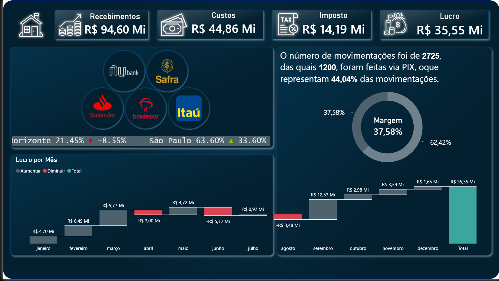

  
  
  
  

---

# 📊 Dashboard Financeiro

📈 Projeto de análise de dados financeiros com foco em indicadores de
performance e apoio à tomada de decisão.

---

## 🎯 Objetivo

Transformar dados financeiros em insights visuais para apoiar a 
tomada de decisão, facilitando a análise de resultados e tendências.

---

## 📌 Visão Geral do Dashboard

---

## 📈 Principais Indicadores

- Receita total
- Despesas totais
- Lucro líquido
- Margem de lucro
- Evolução mensal de resultados

---

## 🧠 Insights Gerados

- Foi identificado um padrão de variação nas receitas ao longo dos meses,
  indicando possível influência de sazonalidade ou ciclos de vendas.
- Períodos de maior despesa impactam diretamente a margem de lucro, reforçando
   a importância do controle de custos operacionais.
- A relação entre receita e despesa permite visualizar a evolução da lucratividade,
   destacando meses com melhor performance financeira.
- Oscilações nos resultados sugerem oportunidades de otimização de processos e
  planejamento financeiro mais estratégico.
- A análise temporal dos dados ajuda a identificar tendências de crescimento ou
  queda, apoiando decisões mais assertivas.

---

## 🛠️ Ferramentas Utilizadas

- Power BI
- Excel
- DAX (quando aplicável)

---

## 🚀 Status do Projeto:

✔ Finalizado

---
Contatos:

Se quiser trocar uma ideia ou falar sobre oportunidades:

WhatsApp: +55 (11)920_855_968

E-mail: jlrpbr@gmail.com

GitHub: https://github.com/Jose-Lopes-Analytics/data-analytics-portfolio/

---

⭐ Grato por visitar meu portfólio!

