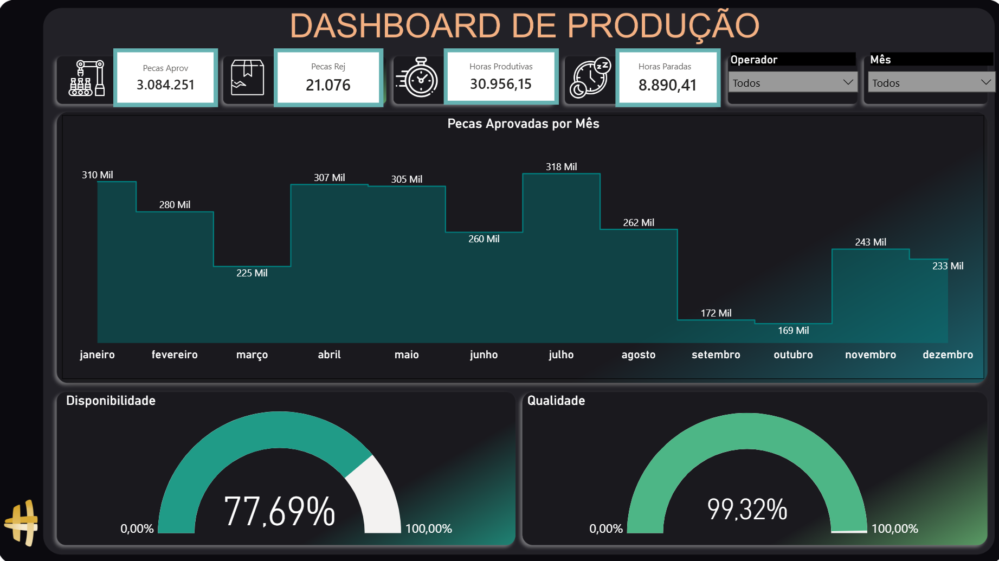

  
  
  
  

---
  
# 🏭 Dashboard de Produção:

Análise de dados voltada para o acompanhamento da performance produtiva, com foco em eficiência 
operacional e identificação de melhorias no processo.

---

## 🎯 Objetivo:

Monitorar e avaliar indicadores de produção para apoiar decisões relacionadas à eficiência, 
produtividade e controle operacional.

---

📊 Visão Geral do dashboard:

---

📊 Dashboard interativo:

https://app.powerbi.com/view?r=eyJrIjoiNzVlZmM3NzAtZjFhZC00NzE5LThhMTEtYmFmMzYxN2J
iZGI3IiwidCI6IjY1OWNlMmI4LTA3MTQtNDE5OC04YzM4LWRjOWI2MGFhYmI1NyJ9

---

## 🧠 Insights gerados:

- Variações na produtividade indicam oscilações no desempenho operacional
- A eficiência apresenta comportamentos distintos entre períodos analisados
- A taxa de retrabalho evidencia pontos de melhoria no processo produtivo
- Os dados permitem identificar tendências e apoiar o planejamento da produção

---

## 🛠️ Ferramentas Utilizadas:

- Power BI
- Excel
- Power Query
- DAX 

---

## 🛠️ Ferramentas de Apoio:

- PowerPoint (apresentação)

- MyColorSpace — paletas de cores: https://mycolor.space/

- Flaticon — ícones: https://www.flaticon.com/

- Instant Eyedropper — captura de cores: https://instant-eyedropper.com/

- ImgBB — hospedagem de imagens: https://pt-br.imgbb.com/

---

## 🚀 Status do Projeto:

✔ Finalizado.

---

Contatos:

Se quiser trocar uma ideia ou falar sobre oportunidades:

WhatsApp: +55 (11)920_855_968

E-mail: jlrpbr@gmail.com

https://github.com/Jose-Lopes-Analytics/data-analytics-portfolio

---

⭐ Grato por visitarem o meu portfólio!
