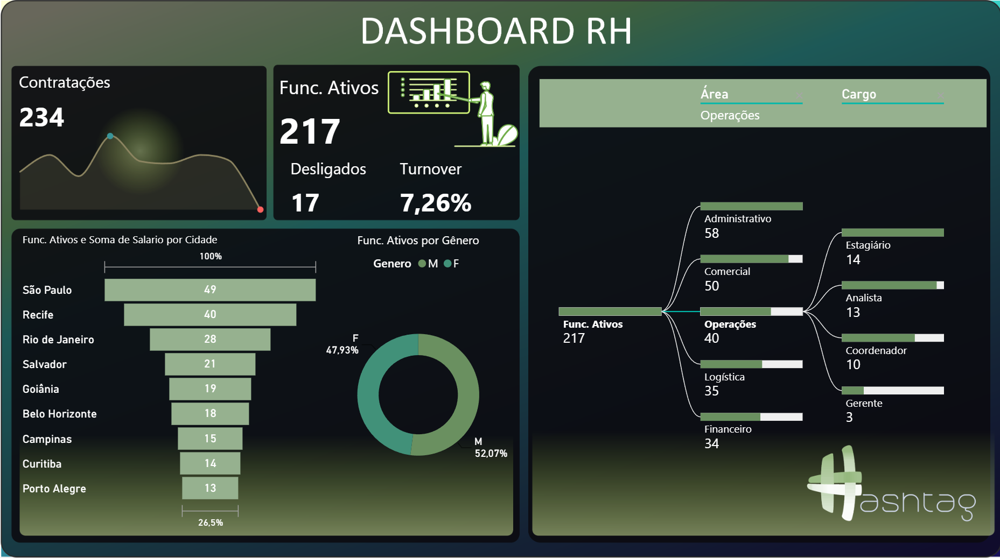

  
  
  
  
  
---

# 👥 Dashboard de Recursos Humanos (RH):

Análise de dados voltada para indicadores de pessoas, com foco em gestão de colaboradores,
desempenho organizacional e visão estratégica de recursos humanos.

---

## 🎯 Objetivo:

Monitorar indicadores de RH para apoiar decisões relacionadas à gestão de pessoas, retenção de talentos e análise do quadro de colaboradores.

--- 

📊 Visão Geral do dashboard

Dashboard Interativo.

https://app.powerbi.com/view?r=eyJrIjoiZjZhYjAzMWItN2ZjYS00OGFjLWE4Y2UtNWVmMTdkODJkNj
FkIiwidCI6IjY1OWNlMmI4LTA3MTQtNDE5OC04YzM4LWRjOWI2MGFhYmI1NyJ9

---

📈 Principais Indicadores

- Número total de colaboradores
- Taxa de turnover
- Admissões e desligamentos
- Distribuição por área ou setor
- Tempo médio de empresa

---

🧠 Insights

- Análise de rotatividade de colaboradores ao longo do tempo
- Identificação de períodos com maior volume de admissões e desligamentos
- Avaliação da distribuição do time por áreas organizacionais
- Indicadores que ajudam a entender retenção e estabilidade da equipe
- Suporte à tomada de decisão em gestão de pessoas

---

🛠️ Ferramentas Utilizadas

- Power BI

- Excel

- DAX

---

🛠️ Ferramentas de Apoio

- PowerPoint (apresentação)

- MyColorSpace — paletas de cores: https://mycolor.space/

- Flaticon — ícones: https://www.flaticon.com/

- Instant Eyedropper — captura de cores: https://instant-eyedropper.com/

- ImgBB — hospedagem de imagens: https://pt-br.imgbb.com/

---

🚀 Status do Projeto:

✔ Finalizado

---

Contatos:

Se quiser trocar uma ideia ou falar sobre oportunidades:

WhatsApp: +55 (11)920_855_968

E-mail: jlrpbr@gmail.com

https://github.com/Jose-Lopes-Analytics/data-analytics-portfolio

---

⭐ Grato por visitarem o meu portfólio!

