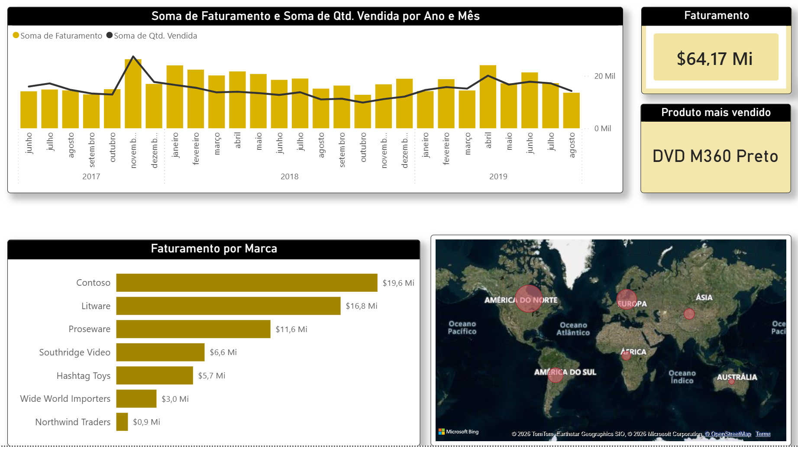

  
  
  
  

---

# 🏭 Dashboard de Produção

Este projeto tem como objetivo analisar indicadores de produção, avaliando eficiência operacional, 
volume produzido e desempenho dos processos.

---

🎯 Objetivo

Acompanhar os principais indicadores de vendas para apoiar decisões estratégicas relacionadas a 
faturamento, performance de produtos e evolução comercial.

---

## 📊 Visão Geral do Dashboard

---

📈 Principais Indicadores

- Faturamento total
- Volume de vendas
- Ticket médio
- Evolução de vendas por período
- Performance por produto ou categoria

---

- 🧠 Insights

- Identificação de períodos de maior e menor desempenho de vendas
- Análise de variação no faturamento ao longo do tempo
- Produtos ou categorias com melhor performance comercial
- Tendências de crescimento ou queda nas vendas
- Comportamento geral do cliente ao longo dos períodos

---

🛠️ Ferramentas Utilizadas

Power BI
Excel
DAX

---

🛠️ Ferramentas de Apoio

PowerPoint (apresentação)

MyColorSpace — paletas de cores: https://mycolor.space/

Flaticon — ícones: https://www.flaticon.com/

Instant Eyedropper — captura de cores: https://instant-eyedropper.com/

ImgBB — hospedagem de imagens: https://pt-br.imgbb.com/

---

🚀 Status do Projeto:

✔ Finalizado

---

Contatos:

Se quiser trocar uma ideia ou falar sobre oportunidades:

WhatsApp: +55 (11)920_855_968

E-mail: jlrpbr@gmail.com

GitHub: https://github.com/Jose-Lopes-Analytics/data-analytics-portfolio/

---

⭐ Grato por visitar meu portfólio!

